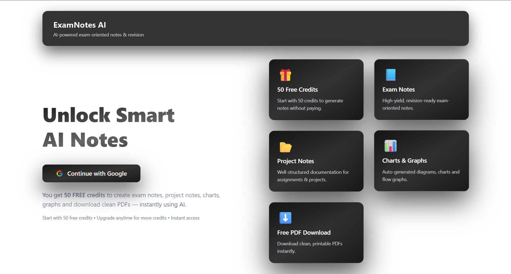

<!DOCTYPE html>
<html lang="en">
<head>
  <meta charset="UTF-8">
  <meta name="viewport" content="width=device-width, initial-scale=1.0">
  <title>ExamNotesAI</title>
</head>
<body>

<h1>📚 ExamNotesAI</h1>

<b>AI Powered Smart Notes Generator</b> 
Generate structured, exam-ready notes instantly using AI and boost your productivity.

<!-- 🔥 LIVE DEMO -->

<h2>🌐 Live Demo</h2>

  

  👉 <b>Try the app live and generate AI-powered notes instantly.</b>

  🔗 <a href="https://examnotesai-1-sjel.onrender.com" target="_blank">
    https://examnotesai-1-sjel.onrender.com
  </a>

<h2>🚀 Live Demo</h2>

Experience ExamNotesAI in action — generate AI-powered notes instantly.

🔐 Authentication   •   🤖 AI Notes   •   📄 Smart Output   •   ⚡ Fast Generation

<h2>📸 Project Preview</h2>

  

<b>Generate Notes with AI Intelligence</b>

<h2>📌 Overview</h2>

ExamNotesAI is an AI-powered platform that helps students generate high-quality, structured notes instantly from any topic or question. 
It simplifies complex concepts into easy-to-understand content, making exam preparation faster and more efficient.

<h2>✨ Features</h2>

🤖 AI-Powered Notes Generation 
📚 Topic-based input system 
⚡ Real-time note creation 
📄 Structured & clean output 
🔐 User authentication 
☁️ Cloud-based access

<h2>🧩 How It Works</h2>

1. Enter Topic 
Provide any subject or question.  

2. AI Processing 
AI analyzes and generates structured notes.  

3. Get Notes 
Instant, readable, exam-ready content.

<h2>🧠 AI Capabilities</h2>

Smart Content Generation 
Concept Simplification 
Structured Formatting 
Fast Response Generation

<h2>🛠️ Tech Stack</h2>

Frontend: React (Vite) 
Backend: Node.js, Express 
Database: MongoDB 
Auth: JWT + Cookies 
AI: Gemini API / OpenAI API

<h2>🔁 Architecture</h2>

<pre>
flowchart LR

A[👤 User Browser]
A --> B[⚛️ Frontend (React + Vite)]
B -->|REST API| C[🟢 Backend (Node.js + Express)]
C --> D[🔐 Auth Service (JWT + Cookies)]
C --> E[🧠 Notes Generator Engine]
E --> G[🤖 AI API]
C --> I[(🗄️ MongoDB)]
I -->|User Data| C
I -->|Notes Data| C
C -->|JSON Response| B
B -->|Rendered UI| A
</pre>

<h2>📂 Project Structure</h2>

<pre>
ExamNotesAI/
│
├── client/                  
│   ├── src/
│   ├── public/
│   └── ...
│
├── server/                  
│   ├── config/
│   ├── controllers/
│   ├── models/
│   ├── routes/
│   ├── services/
│   └── ...
│
└── README.md
</pre>

<h2>⚙️ Installation</h2>

<pre>
git clone https://github.com/anup-verma01/ExamNotesAI
cd examnotesai
</pre>

<b>Client</b>

<pre>
cd client
npm install
npm run dev
</pre>

<b>Server</b>

<pre>
cd server
npm install
npm run dev
</pre>

<b>Environment Variables</b>

<pre>
MONGO_URI=
JWT_SECRET=
AI_API_KEY=
</pre>

<h2>🚀 Future Improvements</h2>

📥 Download notes as PDF 
🗣️ Voice input support 
🌐 Multi-language 
📊 Personalized analytics

<h2>🤝 Contributing</h2>

Fork and create a pull request.

<h2>📜 License</h2>

MIT License

<b>💡 Built by Anup Kumar Verma</b>

⭐ Star this repo if you like it!

</body>
</html>
